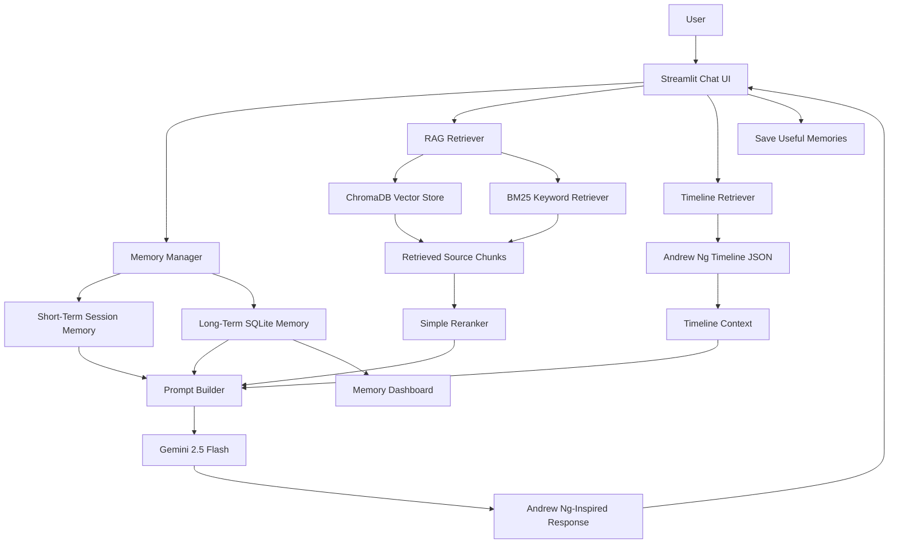

# AndrewAI: Digital Twin Project

This project is my attempt at building an educational digital twin inspired by Andrew Ng's public teaching style. It is not the real Andrew Ng, and it is not endorsed by him or by Stanford, Coursera, or DeepLearning.AI.

I chose Andrew Ng because his teaching is easy to recognize: he usually explains the intuition first, then connects it to a practical machine learning workflow. Since this assignment is about making a digital twin of a scientist or researcher, I thought an ML teacher like Andrew Ng was a good choice.

## What The Project Does

AndrewAI is a Streamlit chatbot for learning AI and machine learning topics. The chatbot tries to answer in an Andrew Ng-inspired teaching style by using:

- Gemini 2.5 Flash for the main answer generation.
- RAG over Andrew Ng-related public or user-provided documents.
- ChromaDB for semantic vector search.
- BM25 for keyword-based search.
- Short-term chat memory using Streamlit session state.
- Long-term memory using SQLite.
- A Memory Dashboard so the user can see what is stored.
- Timeline awareness for questions about Andrew Ng's career or different time periods.
- Retrieved source display so the answer is not just a black box.

The main idea is that the chatbot should not only sound like a helpful ML tutor, but should also use stored documents, user memory, and timeline context when they are useful.

## Problem Statement

The assignment asks us to build a core digital twin-style system around one scientist or researcher. My version focuses on an educational AI assistant inspired by Andrew Ng.

The goal is not to impersonate him. The goal is to simulate some parts of his public teaching style, especially:

- Simple intuition before heavy math.
- Small examples before abstract theory.
- Practical ML project advice.
- Error analysis and iteration.
- Data quality and responsible AI.

## Tech Stack

- Python
- Streamlit
- Gemini 2.5 Flash
- Google Generative AI SDK
- ChromaDB
- SQLite
- PyMuPDF and pdfplumber
- rank-bm25
- python-dotenv
- pandas
- pytest

## Architecture

The full architecture diagram is in [docs/architecture_diagram.md](docs/architecture_diagram.md).



## How The RAG Part Works

The documents are placed in `data/raw/` and listed in `data/sources_manifest.json`. During ingestion, the project:

1. Extracts text from the documents.
2. Cleans and chunks the text.
3. Saves the chunks in `data/processed/chunks.jsonl`.
4. Creates embeddings for the chunks.
5. Stores the vectors in ChromaDB.

When the user asks a question, AndrewAI searches in two ways:

1. Vector search finds chunks that are semantically similar.
2. BM25 finds chunks that match important keywords.

Then the results are merged and reranked. This is useful because vector search is better for meaning, while BM25 is better for exact words like "L2 regularization", "bias", or "Coursera".

## Memory System

There are two types of memory:

- Short-term memory remembers the recent chat during the current session.
- Long-term memory stores useful user preferences or project context in SQLite.

For example, if the user says, "I prefer examples before equations", that can be saved and used later. The Memory Dashboard lets the user inspect, edit, delete, or clear these memories.

I added this dashboard because memory should be visible to the user. Otherwise, it is hard to know what the chatbot is remembering.

## Timeline Awareness

Some questions need time awareness. For example:

> What would Andrew Ng have said about ChatGPT in 2012?

This question should not be answered as if ChatGPT already existed in 2012. So I added a small timeline JSON file with important public Andrew Ng career events. If a question seems time-sensitive, the app adds timeline context and guardrails to the Gemini prompt.

This is not a complete biography. It is just enough to help avoid obvious timeline mistakes.

## Setup

Install dependencies:

```bash
pip install -r requirements.txt
```

Create `.env` from `.env.example`:

```bash
cp .env.example .env
```

Add your Google API key:

```env
GOOGLE_API_KEY=your_google_api_key_here
GEMINI_MODEL=gemini-2.5-flash
EMBEDDING_MODEL=text-embedding-004
REQUEST_TIMEOUT_SECONDS=45
```

## Add Documents

Raw copyrighted documents should not be committed to GitHub. Add only public, permitted, or personally authorized files to `data/raw/`.

Each document should also be listed in `data/sources_manifest.json`, for example:

```json
{
  "id": "unique-source-id",
  "title": "Source Title",
  "type": "book | lecture_notes | article | interview | transcript | webpage",
  "author": "Author or organization",
  "path": "data/raw/source_file.pdf",
  "url": "original public URL if available",
  "license_or_usage_note": "Public educational material / user-provided local file",
  "domain": "machine_learning | deep_learning | ai_strategy | data_centric_ai",
  "include_in_index": true
}
```

Supported formats are `.pdf`, `.txt`, and `.md`.

## Run The Project

Ingest the documents:

```bash
python scripts/ingest_documents.py
```

Run the Streamlit app:

```bash
streamlit run app.py
```

Inspect the vector store:

```bash
python scripts/inspect_vectorstore.py
```

Reset long-term memory:

```bash
python scripts/reset_memory.py
```

Run tests:

```bash
pytest
```

## Bonus Features

I implemented two bonus features:

1. Memory Visualization Dashboard
2. Timeline Awareness

Voice interaction is not implemented in this version. I kept that as future work because the memory dashboard and timeline feature were more directly connected to the assignment.

## Known Limitations

- AndrewAI is not the real Andrew Ng.
- The quality of answers depends on Gemini, API quota, and the documents provided.
- Retrieval can sometimes bring weak context.
- Gemini can still make mistakes.
- The timeline file is small and does not cover every event.
- Memory extraction is simple and can be improved.
- Voice interaction is not included yet.

## Final Status

The main project is complete for the assignment: chat, RAG, Gemini response generation, memory, source display, timeline awareness, documentation, tests, and the architecture diagram are all included.
