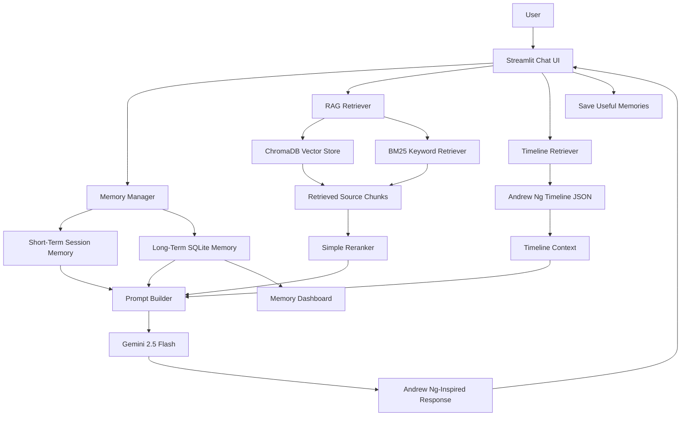

# Architecture

This page explains how I structured AndrewAI. The dedicated assignment diagram is here: [architecture_diagram.md](architecture_diagram.md).

At a high level, the app has five main parts:

1. Streamlit user interface
2. Retrieval system
3. Memory system
4. Timeline system
5. Gemini response generation

## Main Chat Flow

The user asks a question in the Streamlit chat UI. The app then collects useful context before sending the final prompt to Gemini.

The context can come from:

- Recent chat messages in the current session.
- Long-term memories stored in SQLite.
- Retrieved source chunks from the RAG pipeline.
- Timeline events, if the question is about a year or historical context.

After Gemini returns an answer, the app displays the answer and shows retrieved sources separately.

## Retrieval System

The retrieval system uses both ChromaDB and BM25.

ChromaDB is used for vector search. This helps when the user asks something in different words from the source document.

BM25 is used for keyword search. This helps for exact ML terms, names, years, or phrases.

The project combines both results and reranks them. I used a simple hybrid scoring approach because it is easier to understand and still works well for this type of student project.

## Memory System

The memory manager handles two kinds of memory.

Short-term memory is just the recent conversation in Streamlit session state. It helps with follow-up questions like "explain it again using the same example."

Long-term memory is stored in SQLite. It is meant for useful learning preferences and project context, such as:

- The user is new to ML.
- The user prefers examples before equations.
- The user is working on an image classification project.

The Memory Dashboard uses the same memory manager APIs so the user can see and edit what is stored.

## Timeline System

The timeline system uses `data/timeline/andrew_ng_timeline.json`.

It is not meant to be a complete life history. I added it mainly to avoid time-related mistakes. For example, the bot should not talk as if ChatGPT existed in 2012.

If a question has words like "in 2012", "before", "after", "career", or "at that time", the app adds timeline context to the prompt.

## Prompt And Gemini

The prompt builder combines:

- AndrewAI persona instructions
- Disclaimer that it is not the real Andrew Ng
- User question
- Recent conversation
- Long-term memories
- Retrieved chunks
- Timeline context
- Citation/source rules
- Response depth setting

Then Gemini 2.5 Flash generates the final answer.

If Gemini fails because of API key, quota, model name, or network issues, the app shows a clear error message instead of crashing.

## Source Display

The source list is not generated by Gemini. It is created from retrieval metadata using `source_formatter.py`.

I did this because an LLM can invent citations. The app should only show sources that were actually retrieved.

