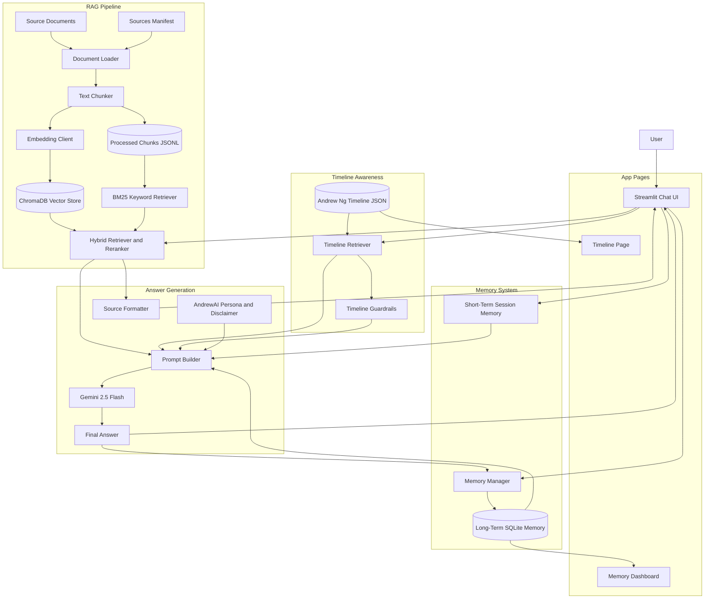

# AndrewAI Architecture Diagram

This is the architecture diagram for the assignment. It shows how the Streamlit app, RAG pipeline, memory, timeline feature, prompt builder, and Gemini model connect together.

## Component Summary

- **Streamlit Chat UI**: Main page where the user asks ML questions and receives answers.
- **RAG Pipeline**: Loads documents, chunks them, stores vectors, and retrieves useful source chunks.
- **ChromaDB**: Stores embeddings for semantic search.
- **BM25**: Helps retrieve chunks using exact keywords.
- **Memory System**: Stores recent chat context and long-term user preferences.
- **Memory Dashboard**: Lets the user inspect and manage long-term memory.
- **Timeline Awareness**: Adds Andrew Ng timeline context for historical questions.
- **Prompt Builder**: Combines persona, memory, RAG context, timeline context, and user question.
- **Gemini 2.5 Flash**: Main LLM used to generate the answer.
- **Source Formatter**: Shows only the sources actually found by retrieval.

The most important design idea is that Gemini does not answer alone. It receives extra context from retrieval, memory, and timeline modules so that the response is more grounded and more useful for an ML learner.
