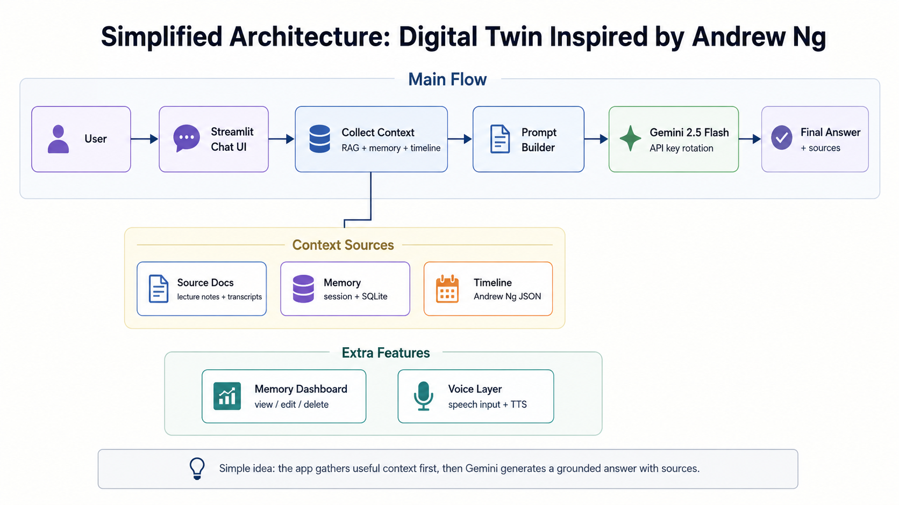

# Digital Twin Architecture Diagram

This is the simplified architecture diagram for the assignment. It focuses on the main flow: the user asks a question, the app gathers context, Gemini generates an answer, and the answer is shown back to the user.

## Component Summary

- **Streamlit Chat UI**: Main page where the user asks ML questions and receives answers.
- **RAG Retrieval**: Finds useful source chunks using ChromaDB vector search and BM25 keyword search.
- **Memory**: Stores recent chat context and long-term user preferences.
- **Timeline Context**: Adds Andrew Ng timeline information for historical questions.
- **Prompt Builder**: Combines the user question, retrieved context, memory, and timeline context.
- **Gemini 2.5 Flash**: Generates the answer and can rotate through multiple API keys if one key hits quota.
- **Voice Layer**: Lets the user speak a question and hear the answer using browser text-to-speech.
- **Memory Dashboard**: Lets the user inspect and manage long-term memory.

The main idea is that Gemini does not answer alone. The app first collects helpful context from retrieval, memory, and timeline modules, then sends a stronger prompt to Gemini.
